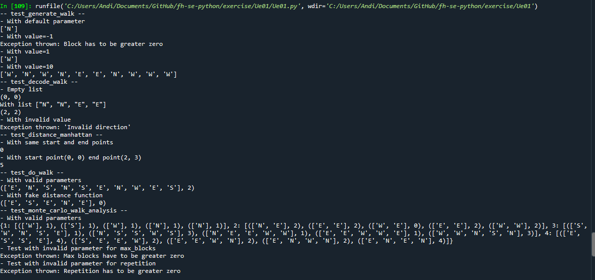

= Übung 1
:author: Andreas Wenzelhuemer
:email: <S1910307106@fhooe.at>
:reproducible:
:experimental:
:listing-caption: Listing
:source-highlighter: rouge
:img: ./img
:toc:
:numbered:
:toclevels: 5
:rouge-style: github

<<<
== Lösungsidee
Für die 4 Richtungen muss ein Tupel directions erstellt werden.

Bei der *generate_walk* Methode muss zu Beginn überprüft werden, ob der Eingangsparameter block valide ist. Falls dieser kleiner 1 ist, wird eine Exception geworfen. Danach wird in einer Schleife n mal ein zufälliger Wert von directions mittels yield zurückgegeben, um den Vorteil von Generatoren auszunutzen.

Bei der *decode_walk* werden zwei Variablen für x und y benötigt und in einer Schleife alle Schritte von walk durchlaufen, je nach Richtung wird dann x und y erhöht oder verringert.

Die *distance_manhattan* berechnet die Manhattan-Distance, indem Start und Endpunkt substrahiert werden und davon der Absolutwert berechnet wird.

Die *do_walk* ruft einfach die anderen Methoden auf und gibt walk und distance als Tuple zurück.

Die *monte_carlo_walk_analysis* überprüft zu Beginn die Parameter auf Gültigkeit, ansonsten werden Exceptions geworfen. Anschließend wird in einer Schleife bis zu max_blocks gezählt und die do_walk Methode n Mal ausgeführt. Anschließend wird mittels max-Funktion die Maximaldistanz berechnet und als Key beim Dictionary für die aktuellen Wanderungen gesetzt.

<<<
== Testfälle

Jede Funktion wurde einzeln auf Standardfall und Edge-Case getestet.

=== generate_walk
1. Testfall: Aufruf der Methode generate_walk ohne Parameter
2. Testfall: Aufruf der Methode generate_walk mit negativem Wert -1 => Exception wird geworfen
3. Testfall: Aufruf der Methode generate_walk mit positivem Wert 1
4. Testfall: Aufruf der Methode generate_walk mit Wert 10

[source, python]
----
def test_generate_walk():
    
    print('-- test_generate_walk --')
    
    print('- With default parameter')
    print(list(generate_walk()))
    
    for value in [-1, 1, 10]:
        print(f'- With value={value}')
        try:
            print(list(generate_walk(value)))
        except ValueError as error:
            print(f'Exception thrown: {error}')
----

=== Testfälle zu "decode_walk"
1. Testfall: Aufruf mit leerer Liste
2. Testfall: Aufruf mit befüllter Liste
3. Testfall: Aufruf mit ungültigen Werten => Exception wird geworfen

[source, python]
----
def test_decode_walk():
    
    print('-- test_decode_walk --')
    
    print('- Empty list')
    print(decode_walk([]))
    
    print('With list ["N", "N", "E", "E"]')
    print(decode_walk(['N', 'N', 'E', 'E']))
    
    try:
        print('- With invalid value')
        print(decode_walk(['N','O']))
    except KeyError as error:
         print(f'Exception thrown: {error}')
----

=== Testfälle zu "distance_manhattan"
1. Testfall: Mit gleichem Start und Endpunkt => Liefert Distanz von 0
2. Testfall: Mit Start Punkt (0, 0) und Endpunkt (2, 3) => Liefert Distanz 5

[source, python]
----
def test_distance_manhattan():
    
    print('-- test_distance_manhattan --')
    
    print('- With same start and end points')
    print(distance_manhattan((0, 0), (0, 0)))
    
    print('- With start point(0, 0) end point(2, 3)')
    print(distance_manhattan((0, 0), (2, 3)))
----

=== Testfälle zu "do_walk"
1. Testfall: Mit gültigen Werten und Standardmethode distance_manhattan
2. Testfall: Mit gültigen Werten und Lambda-Funktion, welche für Distanz immer 0 liefert => Distanz beim Walk ist hier dann logischerweise auch 0

[source, python]
----
def test_do_walk():
    print('-- test_do_walk --')
    
    print('- With valid parameters')
    print(do_walk(10))
    
    print('- With fake distance function')
    print(do_walk(5, lambda start, end: 0))
----

=== Testfälle zu "monte_carlo_walk_analysis"
1. Testfall: Mit gültigen Paramtern max_blocks=5 & repitions=5
2. Testfall: Mit negativem Parameter für max_blocks => Liefert Exception
3. Testfall: Mit negativem Parameter für repetions => Liefert Exception

[source, python]
----
def test_monte_carlo_walk_analysis():
    print('-- test_monte_carlo_walk_analysis --')
    
    print('- With valid parameters')
    print(monte_carlo_walk_analysis(5, 5))
    
    try:
        print('- Test with invalid parameter for max_blocks')
        print(monte_carlo_walk_analysis(-1))
    except Exception as error:
        print(f'Exception thrown: {error}')
        
    try:
        print('- Test with invalid parameter for repetition')
        print(monte_carlo_walk_analysis(10, -1))
    except Exception as error:
        print(f'Exception thrown: {error}')
----

=== Testergebnisse

<<<
== Quellcode

[source, python]
----
include::./Ue01.py[]
----