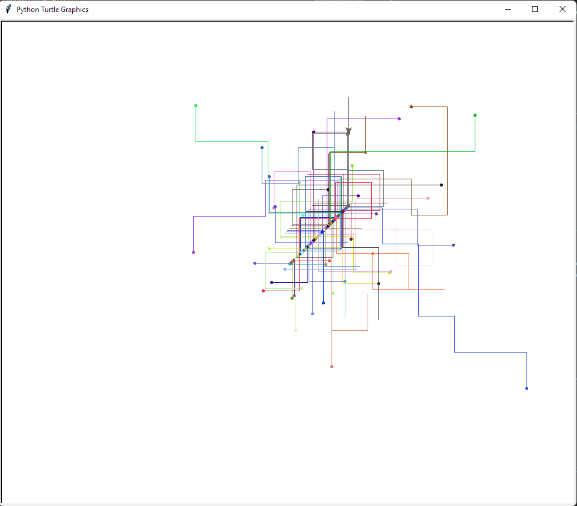

= Übung 2
:author: Andreas Wenzelhuemer
:email: <S1910307106@fhooe.at>
:reproducible:
:experimental:
:listing-caption: Listing
:source-highlighter: rouge
:img: ./img
:toc:
:numbered:
:toclevels: 5
:rouge-style: github

<<<
== Lösungsidee

Für die Erstellung der Walk-Visualisierung wurde eine Prozedur **visualize_walk** erstellt. Dieser wird eine Turtle, ein Walk und eine Ausgangsposition übergeben. Anschließend wird für die übergebene Turtle die Ausgangsposition und die Farbe gesetzt. Für die Generierung eindeutiger Farben gibt es eine Methode **generate_unique_colors**, welche mittels matplotlib eine Anzahl an zufälligen Farben generiert. Anschließend wird ein Startpunkt gesetzt und in einer Schleife jeder Richtungseintrag des Walks durchlaufen. Für jeden Eintrag werden die entsprechenden Grad ermittelt und entsprechend rotiert. Damit immer von dem gleichen Gradwert ausgegangen wird, wird der vorherige Gradwert in einer Variable abgespeichert und abgezogen. Nach der Rechtsrotatien wird eine Linie gezogen und Prozess beginnt von vorne. Zum Schluss wird wieder ein Endpunkt gesetzt.

<<<
== Testfälle

Bei einer maximalen Blockanzahl von 10 und 5 Wiederholungen mittels *monte_carlo_walk_analysis* sieht die Visualizierung folgendermaßen aus:

<<<
Wenn der Pfad von N, E, S, W visualisiert wird, sieht dies folgendermaßen aus:

<<<
== Quellcode

[source, python]
----
include::../src/Walk_Visualization.py[]
----